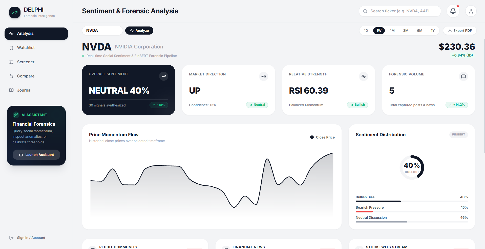
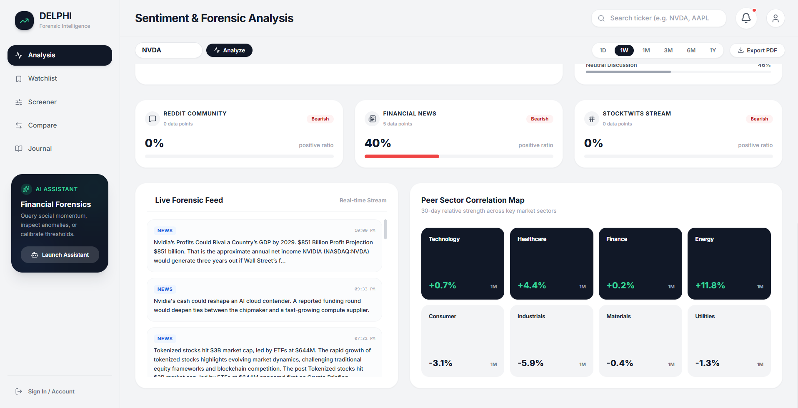

# DELPHI — Market Sentiment Intelligence


[](https://github.com/Ares19v/Delphi/actions/workflows/ci.yml)

<div align="center">

```
██████╗ ███████╗██╗     ██████╗ ██╗  ██╗██╗
██╔══██╗██╔════╝██║     ██╔══██╗██║  ██║██║
██║  ██║█████╗  ██║     ██████╔╝███████║██║
██║  ██║██╔══╝  ██║     ██╔═══╝ ██╔══██║██║
██████╔╝███████╗███████╗██║     ██║  ██║██║
╚═════╝ ╚══════╝╚══════╝╚═╝     ╚═╝  ╚═╝╚═╝
```

**Real-time financial sentiment intelligence powered by FinBERT + Groq**

*Consult many sources. Receive one signal.*

[](https://github.com/Ares19v/Delphi/actions)

[](https://python.org)
[](https://react.dev)
[](https://fastapi.tiangolo.com)

</div>

---

## What It Does

Like the Oracle at Delphi — which synthesized cryptic signals from many hidden sources into a single authoritative prophecy — **Delphi** ingests live data from **Reddit**, **NewsAPI**, and **Finnhub**, runs every article and post through **ProsusAI/FinBERT** (a transformer model pre-trained on financial text), and surfaces the aggregated market sentiment as actionable directional signals — all within seconds of hitting "Generate Report".

---

## 🖥️ Platform Interface

<p align="center">
  
  <br>
  <em>Sentiment & Forensic Intelligence (NVDA): Real-time FinBERT sentiment aggregation (40% Neutral), market direction (UP), RSI 60.39 momentum, and price flow curve.</em>
</p>

<p align="center">
  
  <br>
  <em>Forensic Telemetry & Peer Sector Map: Source breakdown (News, Reddit, StockTwits), live news article stream, and 30-day sector relative strength correlation.</em>
</p>

---

## Features

| Feature | Description |
|---|---|
| **Sentiment Analysis** | FinBERT scores every Reddit post and news article as Bullish / Bearish / Neutral |
| **Sentiment Velocity** | Detects sudden accelerations in crowd momentum before price reacts |
| **Price Momentum** | Live price charts via `yfinance` — no API key required |
| **Directional Signal** | Rule-based weighted score combining sentiment (60%) + RSI (25%) + MACD (15%) |
| **Stock Screener** | Filter 50+ tickers across 7 sectors by signal type and momentum |
| **Compare** | Side-by-side sentiment + technical analysis for any two tickers |
| **Watchlist** | Track saved tickers with live price & RSI — persisted in browser |
| **Trade Journal** | Private markdown notes stored locally — no server needed |
| **AI Assistant** | Groq-powered chatbot (Llama 3.3 70B) that explains the platform |
| **PDF Export** | One-click export of the full dashboard as a timestamped PDF |
| **Auth** | Local sign-up / login (demo auth — localStorage) |

---

## Tech Stack

**Backend**
- Python 3.10 · FastAPI · Uvicorn
- HuggingFace `transformers` + `torch` (FinBERT)
- `yfinance` · `ta` (technical indicators)
- Groq SDK (Llama 3.3 70B)
- `httpx` · `finnhub-python` · `python-dotenv`

**Frontend**
- React 19 · Vite 8 · Tailwind CSS 3
- Recharts · jsPDF · html2canvas · react-markdown · Lucide React

**Infrastructure**
- Docker + Docker Compose
- Nginx (production frontend)
- GitHub Actions CI/CD

---

## Quick Start (Windows)

```bash
# 1. Clone
git clone https://github.com/Ares19v/Delphi.git
cd Delphi

# 2. Add your API keys
copy backend\.env.example backend\.env
# Edit backend\.env and fill in your keys

# 3. Install
INSTALL.bat

# 4. Run
Run_Project.bat
```

The dashboard opens automatically at **http://localhost:5173**

---

## API Keys

Create a `backend/.env` file (copy from `.env.example`):

```env
GROQ_API_KEY=your_key        # https://console.groq.com — Free
NEWSAPI_KEY=your_key         # https://newsapi.org/register — Free
FINNHUB_KEY=your_key         # https://finnhub.io/register — Free
REDDIT_CLIENT_ID=            # Optional — Reddit public API used as fallback
REDDIT_CLIENT_SECRET=        # Optional
```

> The app runs with graceful fallbacks even if some keys are missing. Reddit uses the public JSON API by default (no key needed).

---

## Docker Deployment

```bash
# Copy and fill your env file first
cp backend/.env.example backend/.env

docker-compose up --build -d
```

| Service | URL |
|---|---|
| Frontend | http://localhost:5173 |
| Backend API | http://localhost:8001 |
| API Docs | http://localhost:8001/docs |

---

## Project Structure

```
Delphi/
├── backend/
│   ├── main.py              # FastAPI app + all endpoints
│   ├── market/              # yfinance price data + screener
│   ├── scrapers/            # Reddit, NewsAPI, Finnhub scrapers
│   ├── sentiment/           # FinBERT inference pipeline
│   ├── predictor/           # Direction signal computation
│   ├── requirements.txt
│   └── Dockerfile
├── frontend/
│   ├── src/
│   │   ├── pages/           # Analysis, Watchlist, Screener, Compare, Journal
│   │   ├── components/      # AuthModal, Chatbot, SearchHistory
│   │   └── hooks/           # useAnalysis, useAuth, useSearchHistory
│   └── Dockerfile
├── .github/workflows/ci.yml
├── docker-compose.yml
├── Run_Project.bat
├── INSTALL.bat
└── UNINSTALL.bat
```

---

© 2026 Devansh Tyagi (Ares19v). All Rights Reserved.
